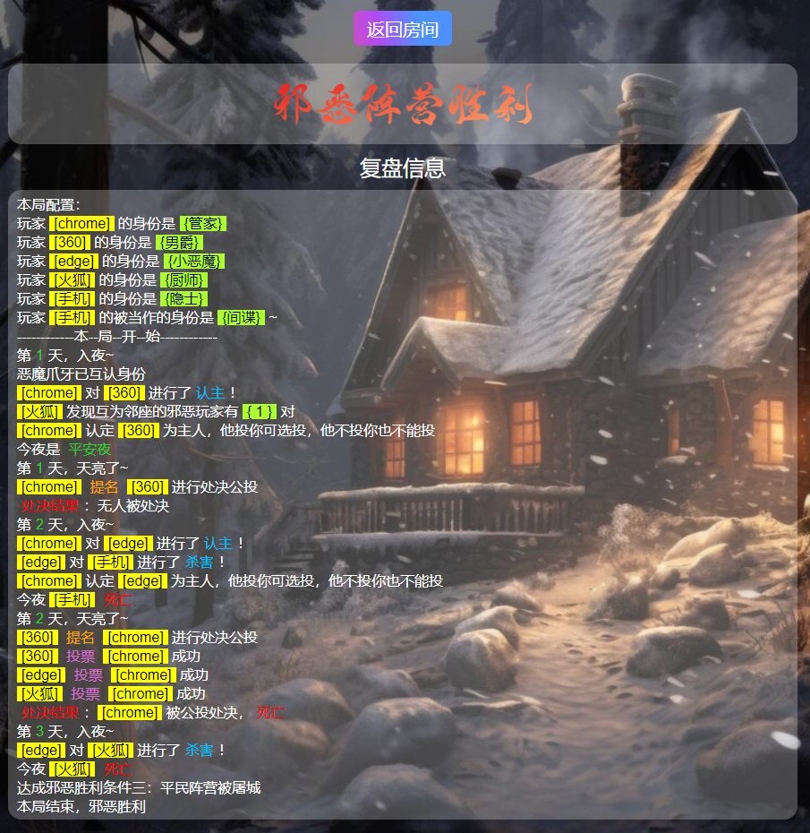

# 血染钟楼 Blood on the ClockTower 

> 血染钟楼桌游线下辅助器
> https://blood.liuzhaomax.cn/

**亮点**：
+ 取代说书人角色，所有线下小伙伴都可以深度参与解谜
+ 全程无需闭眼，不会有长时间的闭目养神和睁眼闭眼过程
+ 全程无倒计时，玩家们可以自由控制各阶段时长
+ 无需按序施放技能，玩家们可同时在某夜或某日释放技能
+ 操作简单，所有操作最多只需点3下，例如施放技能：选人 → 点技能按钮(每人只有一个) → 点确定
+ 丰富明确的提示，解开大部分对于是否可操作的疑惑，减少解答时间
+ 多彩高亮的日志，帮助玩家记忆
+ 防场外，即便晚上没技能，也需要操作手机；隐藏身份信息等
+ 支持断线重连，连接保护
+ 无需注册，无需安装客户端
+ 支持移动端横屏竖屏、PC端，支持所有设备与浏览器

**不足**：
+ 目前只支持《血染钟楼：灾祸滋生》版本
+ 不提供说书人角色，就想当主持人的小伙伴不好意思了
+ 防场外不是绝对的，不过也可以利用场外来掩盖真相，比如故意操作很长时间

## 1. 说明书
### 1.1 游戏概述

> 具体技能见正版游戏说明书，和1.3节（技能细节）

+ 游戏版本：灾祸滋生
+ 阵营与角色
    + 村民（平民阵营）：洗衣妇、图书管理员、调查员、厨师、共情者、占卜师、掘墓人、僧侣、守鸦人、圣女、杀手、士兵、市长
    + 外来者（平民阵营）：管家、酒鬼、隐士、圣徒
    + 爪牙（邪恶阵营）：下毒者、间谍、魅魔、男爵
    + 恶魔（邪恶阵营）：小恶魔
+ 胜利条件
    + 平民：
        1. 恶魔被铲除
        2. 白天剩三人，其中一个是市长，且当日无人被处决
    + 邪恶
        1. 场上没有平民可以提名，且没有杀手或有杀手没有子弹，且没有市长或市长已死
        2. 达成邪恶胜利条件二：可投的票数不大于活人的半数（向上取整），且存活的邪恶玩家数量不小于活人的半数（向上取整），且没有杀手或有杀手没有子弹，且没有市长或市长已死
        3. 平民阵营被屠城
        4. 圣徒被投票处决
+ 与无辅助器的不同之处
    + 没有说书人
    + 全程不需闭眼
    + 技能施放没有顺序限制
    + 玩家面板上，玩家是围坐成一个圈的，也就是左右区域顶部两个玩家是邻座，左右区域底部两个玩家是邻座
    + 间谍（详情见1.3节）
    + 隐士（详情见1.3节）
    + 守鸦人除第一夜，每晚都要点验。假设自己死亡，你要验谁（详情见1.3节）
+ 建议规则
    + 自觉，不要给别人看屏幕，私聊也不要给看，更不要发送截图，这个算作弊
    + 允许公聊，一对一私聊（允许发微信），不要一对多或者多对多私聊
    + 虽然有一定的防窥屏功能，但是还是建议操作时端起手机，平常用纸张衣物遮挡屏幕
    + 等大家都确认已施放技能时，主机再点击切换日夜
    + 等大家都确认不再提名时，主机再点击切换日夜
    + 等大家都确认不再投票时，主机再点击结算投票
+ 注意事项
    + 由于没有登录，一个浏览器绑定一名玩家
    + 五小时未开始游戏，或开始游戏超过五小时未再开始游戏，则房间销毁，如果长时间不开始游戏，请先返回首页再进行操作
    + 如果不在本局中，请不要尝试通过连接进入房间
    + 如果发现操作不正常，且不属于五小时未操作的情况，则刷新页面

### 1.2 游戏流程（结合辅助器）

> 全程无需闭眼，技能施放无顺序

1. 初始状态

2. 点击右上角日夜切换按钮进入第一夜（只有主机有）

3. 选择玩家，发动技能

4. 点击右上角日夜切换按钮进入白天（只有主机有）

5. 点击玩家，发动提名

6. 点击右上角结束投票按钮，结算投票结果（只有主机有）

7. 如果没有人被处决，则还可以提名

8. 大家都同意进入夜晚，则点击日夜切换按钮（只有主机有）

9. 游戏结束后，进入复盘页面

### 1.3 技能细节
+ 洗衣妇
    + 被毒后，有极小概率获取真实信息
+ 图书管理员
    + 被毒后，有极小概率获取真实信息
    + 被毒后，也有极小概率获取“没有外来者”
+ 调查员
    + 被毒后，有极小概率获取真实信息
+ 厨师
    + 一对是两恶相连，两对是三恶连座
+ 共情者
    + 邻座不算死人
+ 占卜师
    + 只会提示有和没有，不会提供数量
    + 隐士被视作恶魔，占卜会读到“有”
    + 有一个玩家会在开局前就设定好被占卜视为的恶魔身份不会变
    + 占卜视作的恶魔和隐士被大家当作恶魔是独立的
    + 可以验死人，死人会受其他技能影响，例如死了的被当作恶魔的隐士被毒，会验不出恶魔
+ 掘墓人
    + 挖到隐士，会看到他被当作的身份，而不是隐士；如果隐士中毒，看到的是隐士
    + 隐士被处决，下毒再毒，挖出来是隐士身份，而不是被当作的身份
+ 僧侣
    + 不能守自己
    + 守护可挡刀，不可挡毒
+ 守鸦人
    + 守鸦人需要在每晚（除第一夜）验人（程序需要），可以每晚假定死的是自己，则要验谁
    + 转天自己没死，则没有信息
    + 可以验死人
    + 验到隐士，会看到他被当作的身份，而不是隐士；如果隐士中毒，看到的是隐士
+ 圣女
    + 村民提名立即触发技能
    + 其他身份提名，会让圣女失去能力，而且进入投票环节
    + 被毒，也会消耗技能，但不会有人被弹死
+ 杀手
    + 白天开枪，立即结算
    + 枪毙被当作恶魔的隐士，隐士直接死亡
    + 被枪毙者不暴露身份
+ 士兵
    + 可与守护叠加
+ 市长
    + 可达成平民胜利条件二
+ 管家
    + 主人投票，他可选投
    + 主人不投票，他票作废，会再结算投票时把票补回来
    + 管家不能认主死人
    + 中毒后，依然收到认主信息，但实际没有认主，本轮不可能投票有效
+ 酒鬼
    + 开局获取身份，自己并不知道自己是酒鬼
+ 隐士
    + 开局被当作的邪恶身份，爪牙或恶魔
    + 如果被当作间谍，别人看他，他将不是邪恶的
    + 被毒会变回隐士
+ 圣徒
    + 可达成邪恶胜利条件四
+ 下毒者
    + 毒隐士会让隐士不再邪恶，如果隐士被视作恶魔，被毒也不再被视作恶魔
    + 毒间谍会让间谍变为邪恶
    + 毒只在当晚和接下来的白天起作用
    + 死在夜里，或者转变为恶魔，当夜技能无效
+ 魅魔
    + 恶魔自刀，优先变恶魔
    + 恶魔被处决后，活人数量依然大于等于5，转变为恶魔
+ 男爵
    + 开局技能生效
+ 间谍
    + 第一夜可获取所有身份，身份绝对正确，获取身份不受毒的影响
    + 被毒会变为邪恶
    + 恶魔可以直接知道间谍的身份，而不是只知道他是爪牙
+ 小恶魔
    + 被毒就是平安夜
    + 有一定概率直接刀死市长，市长会有概率转移弹死除恶魔外的一切活人
    + 自刀，有魅魔，魅魔先变小恶魔，没魅魔，随机一个变

### 1.4 进入游戏UI介绍
从上到下，从左到右
+ 主控区域
    + 返回房间按钮：一旦退出游戏，不可再重新进入刚才退出的游戏
    + 显示/隐藏身份开关：防窥屏
    + 游戏功能介绍按钮
    + 日夜切换按钮：带有防连击保护功能
    + 结束投票按钮：只能在投票环节点击
+ 主信息
    + 名字
    + 身份
    + 身份类型
    + 提名按钮
    + 投票按钮
+ 玩家面板
    + 当前环节：未开始、技能施放、自由发言、投票处决
    + 玩家名字
    + 技能按钮
+ 日志面板

## 2. 需求与设计

页面
----功能 API
--------输入输出

+ 房间列表页 /home
    + 加载房间列表 
        + 输入：action:list_rooms, playload:playerId
        + 输出：roomList
    + 创建房间 
        + 功能：创建的房间的state赋值
        + 输入：action:create_room, playload:Room
        + 输出：roomList
    + 加入房间 
        + 功能：验证密码；当前用户重连；新玩家加入
        + 输入：action:join_room, playload:JoinRoomPayload
        + 输出：roomList
+ 等待开始页 /room/:roomId
    + 加载房间 
        + 输入：action:list_players, playload:playerId
        + 输出：room
    + 退出房间 
        + 功能：房间减少当前玩家，如果房间人数为0，则销毁房间；
        + 输入：action:quit_room, playload:playerId
        + 输出：room
    + 开始游戏 
        + 功能：改变房间state
        + 输入：action:start_game, playload:""
        + 输出：room
+ 游戏中页
    + 加载游戏 /game/:roomId/:playerId
        + 功能：根据人数，分配身份；夜晚读秒
        + 输入：action:load_game
        + 输出：game
    + 退出游戏 /game/:roomId/:playerId
        + 输入：action:quit_game
        + 输出：game
    + 游戏过程 /gaming/:roomId/:playerId
        + 输入：action, targets:[playerId]
        + 输出：操作结果日志string
+ 游戏结算页 /review/:roomId
    + 加载结算 /room/:roomId
        + 输入：action:review_game, playload:playerId
        + 输出：room
    + 返回房间 /room/:roomId
        + 输入：action:back_to_room, playload:playerId
        + 输出：room
+ 其他功能
    + 房间15分钟没有开始，自动销毁
    + 等待开始时，断线重连 √
    + 游戏中时，断线重连

## 3. 日志设计

### 日志分类
+ 总日志：记录全部
+ 个人日志：记录自己可见的事件

### 事件分类
+ 公共事件（透明底，白字）
    + 重大事件
        + 样式：红字加粗
        + 词语：死亡|处决结果|提名|投票|平安夜
    + 玩家名字
        + 样式：黄底，黑字
        + 词语：[]包裹
    + 数字
        + 样式：紫色
        + 词语：第1夜
+ 私有事件
    + 个人技能
        + 样式：蓝字
        + 词语：下毒|占卜|认主|守护|杀害|枪毙|弹
    + 技能结果
        + 样式：绿底黑字
        + 词语：{}包裹

### 字体
段宁毛笔雅韵体

## 4. 游戏流程设计

+ 阶段 stage：夜晚和白天各为一个阶段
+ 环节 step：行为互斥
    + 技能施放环节：夜晚发动技能的角色在此环节施放技能
    + 自由发言环节：白天发动技能的角色在此环节施放技能，此环节可提名
    + 投票处决环节：此环节可投票

### 第一夜
1. 下毒 操作
2. 洗衣妇 日志
3. 图书管理员 日志
4. 调查员 日志
5. 厨师 日志
6. 共情者 日志
7. 占卜师 操作
8. 管家 操作
9. 间谍 日志

### 其他夜晚
1. 下毒 操作
2. 僧侣 操作
3. 魅魔 日志
4. 小恶魔 操作
5. 守鸦人 日志
6. 共情者 日志
7. 占卜师 操作
8. 管家 操作
9. 掘墓人 日志

### 白天
1. 圣女 日志
2. 杀手 操作
3. 士兵 日志
4. 市长 日志
5. 圣徒 日志

## 5. 功能测试

职业技能与处决，交互测试清单：
+ ~~小恶魔~~ 
    + ~~击杀~~
    + ~~刀士兵~~
    + ~~刀僧侣守护的人~~
    + ~~刀市长~~
    + ~~无魅魔自刀~~
    + ~~无魅魔，存活大于等于5人，被处决~~
    + ~~无魅魔，存活小于5人，被处决~~
+ 魅魔
    + 小恶魔自刀
    + 存活大于等于5人，小恶魔被处决
    + 存活小于5人，小恶魔被处决
+ ~~男爵~~
    + ~~少两个村民，多两个外来者~~
+ ~~间谍~~
    + ~~非邪恶玩家~~
    + ~~知晓所有身份~~
    + ~~屠城胜利条件~~
+ 下毒者
    + ~~毒小恶魔~~
    + 毒魅魔
    + 毒间谍
    + 毒圣徒
    + 毒隐士
    + 毒管家
    + 毒市长
    + 毒士兵
    + 毒杀手
    + ~~毒圣女~~
    + 毒守鸦人
    + ~~毒僧侣~~
    + 毒掘墓人
    + ~~毒占卜师~~
    + 毒共情者
    + 毒厨师
    + 毒调查员
    + 毒图书管理员
    + 毒洗衣妇
+ 圣徒
    + 胜利条件
+ ~~隐士~~
    + ~~初始化身份~~
+ ~~酒鬼~~
    + ~~初始化身份~~
+ 管家
    + ~~认主~~
    + 主人投票，他可选投
    + ~~主人不投，他投了也不算~~
+ ~~市长~~
    + ~~胜利条件2~~
+ ~~士兵~~
    + ~~被刀~~
+ ~~圣女~~
    + ~~弹~~
+ 杀手
    + ~~枪毙恶魔~~
    + 枪毙其他人
+ 守鸦人
    + 被刀验人
    + 看隐士看他被视作的身份
    + 验死人
+ ~~掘墓人~~
    + ~~无人处决~~
    + ~~验被处决人的身份~~
    + ~~挖隐士看他被视作的身份~~
+ ~~占卜师~~
    + ~~初始化恶魔~~
    + ~~选2人占卜~~
    + ~~验死人~~
+ 共情者
    + 隐士邻座
+ 厨师
    + 连座
+ ~~调查员~~
+ ~~图书管理员~~
+ ~~洗衣妇~~

## TODO 后续版本
+ 直接通过链接进入房间，不被允许
+ 玩家名字不允许重复，不能为空，长度
+ 标记玩家，自认他是什么，我认为他是什么
+ 退出游戏后，主机转变
+ 语音提示行为
+ ☆房间只存在5小时，超时后销毁：后端持续检测销毁房间完成，前端销毁后跳转首页未做
+ 座位九宫格排列，用来表示邻座关系，单数最上面空着
+ 总日志所有人名后面带身份
+ ipad灰屏bug

